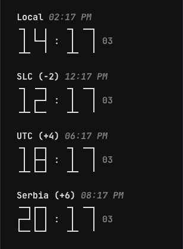

# terminalWorldClock

terminal app for a world clock using textual for a TUI  
https://textual.textualize.io/  
https://github.com/Textualize/textual  



### Dev hot reload
hot-reload with pytest-watch:  
```bash
ptw --runner "textual run main.py --dev"  
```
